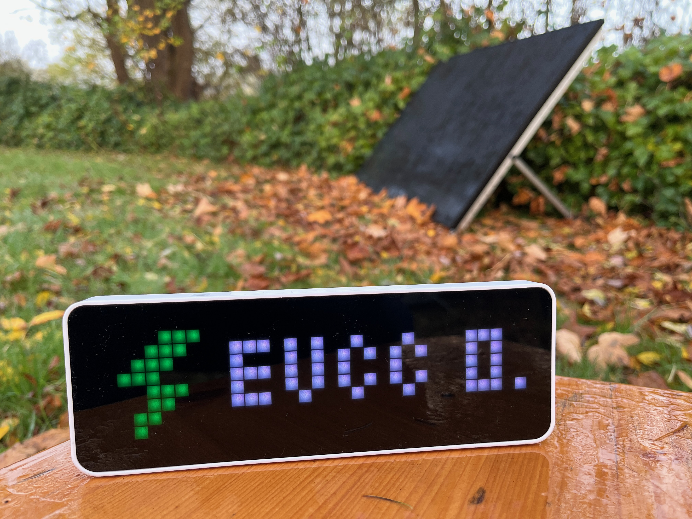

# evcc AWTRIX 3 node-RED flow
Show [evcc](https://evcc.io/) data to your [AWTRIX 3](https://blueforcer.github.io/awtrix3/) flashed [Ulanzi TC001 Smart Pixel Clock](https://www.ulanzi.de/products/ulanzi-pixel-smart-uhr-2882?ref=stnk).



## Implemented screens/apps

### Home power

Shows the power consumption of your household.


### PV power

Shows the power of your solar panels. It is not shown in case there is no power.


### Grid power

Shows the power taken from grid (red icon) or given to the grid (green icon). If there is no power to or from grid, this is not shown.


### Battery SOC

Shows your home battery state of charge. The bar on the bottom also represents the SOC. The icon is animated if power is drawn or charged. In case there is no power, the icon shows the SOC.


### Battery power

Shows the power taken from the battery (icon with arrow from battery) or given to the battery (icon with arrow to battery).


### Vehicle SOC

This shows your vehicle's state of charge if the car is connected to the loadpoint. The bar on the bottom also represents the SOC.

Only one loadpoint is implemented, but you can easily add another one.


### Vehicle charging power

You'll see this when charging the car at loadpoint 1.


### evcc version

The screen will show up during start a few times only.


## Prerequisites

### Hardware

You need a device that can be [flashed with AWTRIX 3](https://blueforcer.github.io/awtrix3/). Right now this is the [Ulanzi TC001 Smart Pixel Clock](https://www.ulanzi.de/products/ulanzi-pixel-smart-uhr-2882?ref=stnk). Flashing instructions can be found [here](https://blueforcer.github.io/awtrix3/#/quickstart).

I have it plugged to the wall with a 2 amps adapter ([something like this](https://amzn.to/3YOrcql)). I also have plugged a timer ([something like this](https://amzn.to/4fgebLm)) in between to charge and discharge the TC001 internal battery. So it does not keep fully charged over time.

You can also use DIY hardware. Please refer to the [website of the AWTRIX 3 maintainer](https://blueforcer.github.io/awtrix3/).

### Software

You need already set up and running:
- evcc (https://evcc.io/)
- AWTRIX 3 flashed device (https://blueforcer.github.io/awtrix3/)
- MQTT broker like Mosquitto (https://mosquitto.org/)
- Node-RED (https://nodered.org/)

## Installation

### Setup MQTT broker
1. Connect evcc to your MQTT server by editing your `evcc.yaml`:
```
# mqtt message broker
mqtt:
  broker: <IP address>:1883
  topic: evcc
  user: <mqtt user if any>
  password: <mqtt password if any>
```
2. Restart evcc.
3. You should now see evcc publishing information to MQTT. You may use something like "MQTT Explorer" (https://mqtt-explorer.com/) to connect to your MQTT broker and check if you see "evcc" topics. 
4. Connect the AWTRIX device to your MQTT server by going to the IP adresss of the device and choose "MQTT" in menu. Enter MQTT information and remember the "prefix". You'll need it later in the Node-RED flow.
5. You should now see the AWTRIX device publishing information to MQTT. Check for the "prefix" topic. 

### Import the flow and do relevant changes

1. Download the JSON file and import it to Node-RED by clicking the burger menu and choose "import".
2. Change the variable "awtrix_prefix" in the "vars" node to the MQTT topic of your AWTRIX device (remember the "prefix").
3. Also change the MQTT server settings in Node-RED to your MQTT server (see right side settings icon "MQTT"). Or delete it if you already have one configured for other flows.
4. Click "deploy" to save everything and see it running.
5. Node-RED will now write the apps to your AWTRIX device (see "custom" folder) and the apps will show up.

### Download icons to the AWTRIX device

Download all icons used by the flow to your AWTRIX device by going to the IP address of the device and choose "Icons" in menu. Download all icons by pasting only the icon ID in the field. You can find all icon IDs in the "Readme.1st" node of the already imported flow.

Please refer to the following page for downloading icons to the device:
https://blueforcer.github.io/awtrix3/#/icons

Now all apps will have an icon.

### Set your AWTRIX settings

You can set device settings in "config" node and also deaktivate standard AWTRIX apps.

## Flow modifications and updates

Feel free to change the imported flow to your own needs. You may want to add a 2nd loadpoint. You may also change the icons. Check the "Readme.1st" node for further information. - Enjoy it. :-)

In case I update the flow due to calculation changes or fixing bugs, you need to import the whole flow again to Node-RED. It will automatically import as a new flow, so you won't loose your mods. You need to check on your own what has been changed or transfer your mods.

## Known issues and limitations

### Issues

- Maybe old information will be shown before new data is pulled from the MQTT broker during startup of the AWTRIX device. This seems to be due to caching or the device or Node-RED does not recognize new data. This will need a few minutes then.

### Limitations

- As the MQTT broker is the service in between, everything relies on MQTT. If there is no new data pushed from other systems (in this case evcc) to MQTT, the device will not show the information anymore after a few times because Node-RED will only pull new data. - This can be fixed with an "inject" node which triggers to push the app data again to MQTT for the AWTRIX device. See "vehicleSoc" for reference.

## Changelog

#### 2024-12-19

- Change "vars" node to "config" node
- Add more parameters to config node
- Move all AWTRIX settings to config node
- Add %-bar/battery soc to battery power app

#### 2024-10-30

- Fix brightness issue in awtrix settings node
- Rename function nodes
- Rename loadpoint specific variables
- Add prefix variable for AWTRIX app names

#### 2024-10-26

- Initial version